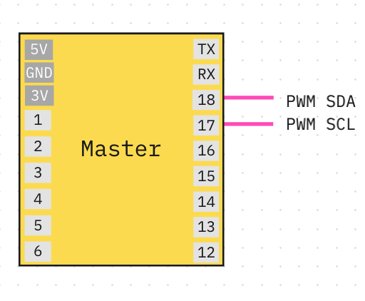
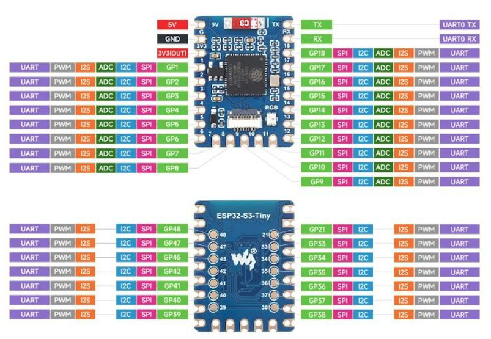
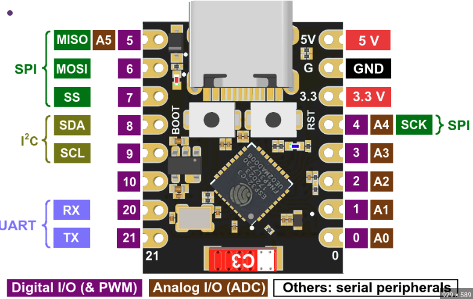

# FastLED 用戶文檔
***此專案使用 PlatformIO IDE！ 不支援ArduinoIDE***

---

## <span style="color: green;">✅ 重點 ✅  checklist</span>
1. 請檢查：根目錄是否有一個名為`platformio_local.ini`的檔案，如沒有，你需要自行create，並複製貼上以下內容：
```ini
[env:esp32dev]
monitor_port = /dev/cu.usbmodem11201 #用來監聽log的port
```
2. 在 `platformio.ini` 中設定你的 `ACTUAL_NUM_PWM`
3. 在 `platformio.ini` 中設定你的 `PWM_ADDRESS`

---
## 線路圖


## ESP32(S3)mini 開發板 GPIO


## ESP32(C3) 開發板 GPIO


## 前置要求
此專案主要使用 FastLED 來控制 RGB 燈光。
建議先學習 FastLED 的基礎知識。
- 教學影片：
  https://www.youtube.com/watch?v=4Ut4UK7612M&list=PLgXkGn3BBAGi5dTOCuEwrLuFtfz0kGFTC
- 文件：
  https://fastled.io/docs/


## PlatformIO 設定
`platformio.ini` 檔案包含所有開發者共用的設定
**[env:esp32dev]**：`esp32dev` 環境的設定。


## Serial Monitor
用來監示晶片的log
`pio device monitor -p /dev/cu.usbmodem21201`
**需要手動更改port no**
