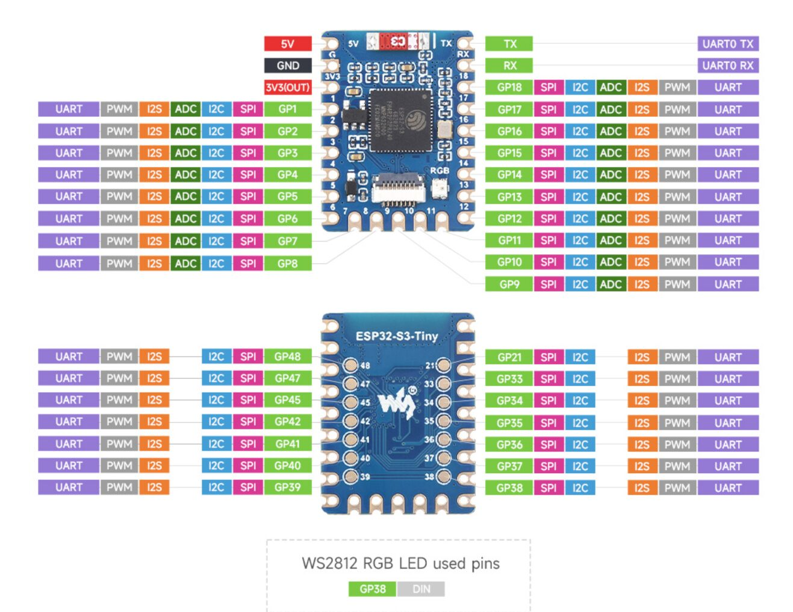
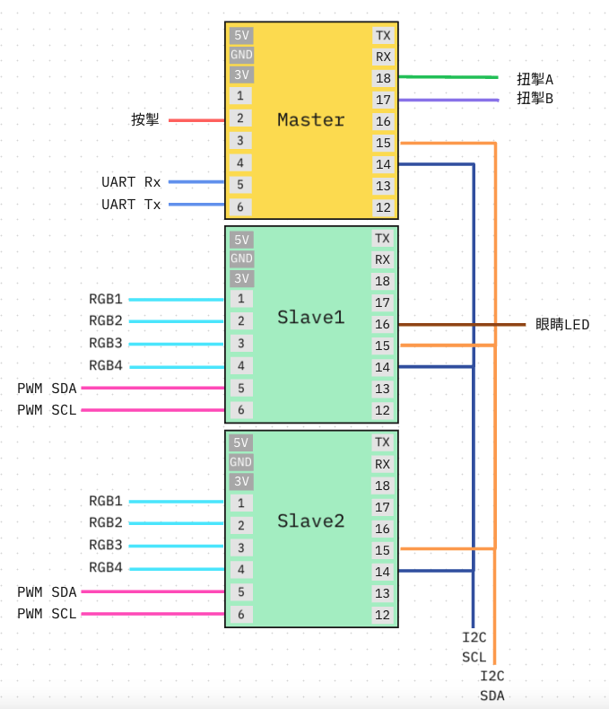

# FastLED 用戶文檔
***此專案使用 PlatformIO IDE！ 不支援ArduinoIDE***

---

## ✅ 懶人包 ✅ 新增env的checklist
1. 改``UART_VIDEO_ADDR`` (如果要用mini mon)
2. 改``SLAVE_ID``
3. 改``I2C_SLAVE_ADDR`` ⚠️ **地址必須從 0x10 開始，依序遞增 (0x10, 0x11, 0x12...)**
4. 改``ACTUAL_SLAVE_NUM``
5. 改``WIFI_NAME``
6. 改``ACTUAL_NUM_PWM``
7. 改``PWM_ADDRESS``
8. 改``NUM_LEDS_RGB1_X`` (彩色LED燈珠數目)
9. 第一次燒master晶片，記得master要行一次``pio run --target uploadfs -e master``
10. 改``DEBUG_ENABLED`` (適用於開發階段，需要睇log)
---

## ESP32(S3)mini 開發板 GPIO

## 電路圖

## 前置要求
此專案主要使用 FastLED 來控制 RGB 燈光。
建議先學習 FastLED 的基礎知識。
- 教學影片：
  https://www.youtube.com/watch?v=4Ut4UK7612M&list=PLgXkGn3BBAGi5dTOCuEwrLuFtfz0kGFTC
- 文件：
  https://fastled.io/docs/

-----------

## 程式碼庫與環境
此專案包含三個獨立的程式碼庫和環境，每個都有不同的功能：

1. **master**：
   - **env**：`master`
   - **描述**：負責整體系統運作，處理與外部硬件（例如timer)溝通，wifi update晶片。透過I2C與slave溝通燈效。
   - **進入點**：`firmware/master/src/main.cpp`
   - **命令列**：`pio run -e master -t upload`

2. **slave1**：
   - **env**：`slave1`
   - **描述**：負責顯示燈效，經I2C與master溝通
   - **進入點**：`firmware/slave/src/main_slave.cpp`
   - **命令列**：`pio run -e slave1 -t upload`

上傳`/data`裡的資料到晶片（用於 wifi-update 網頁）：⚠️ **忽略這步將會使master無法開啓wifi網頁**
`pio run --target uploadfs -e master`
編譯並燒錄晶片：
`pio run --target upload -e master -e slave1`

-----------

## PlatformIO 設定

###1.  `platformio.ini` - 共享配置
包含專案的基礎設定，所有開發者共用：

**[env]**：通用環境設定
- `MAX_NUM_SLAVE`：最大 slave 數量
- `DEBUG_ENABLED`：0=不需要Log，1=需要
- `LOG_TIMESTAMPS`：0=不需要log時間，1=需要

**[env:master]**
**[env:slave1-7]**
- `SLAVE_ID`：⚠️ **重要** 每個slave都被分配了唯一的 SLAVE_ID（1-7）**不可重複！**
- `SLAVE_I2C_ADDR`：I2C 地址（0x10-0x16）**必須從 ``0x10`` 開始順序**

### 2. `platformio_local.ini` - 本地配置
每個開發者需要在此檔案設定自己的local配置（此檔案已加入 .gitignore）：

**[env:master]**
- `WIFI_NAME`：WiFi 名稱
- `ACTUAL_SLAVE_NUM`：實際 slave 數量
- `ENABLE_VIDEO_UART`：是否需要UART螢幕播片
- `upload_port`：你正在使用的 Port
- `monitor_port`：與 upload_port 相同
- `STORYMODE_0_TOTAL_SECONDS`: storymode0 總時長
- `STORYMODE_1_TOTAL_SECONDS`: storymode1 總時長
- `STORYMODE_2_TOTAL_SECONDS`: storymode2 總時長
- `STORYMODE_3_TOTAL_SECONDS`: storymode3 總時長

**[env:slave1-7]**
- `WIFI_NAME`：WiFi 名稱
- `NUM_LEDS_RGB0-4`：彩色LED燈珠數目（根據實際需求調整）
- `ACTUAL_NUM_PWM`：⚠️ **重要** 實際的 pca9685 數量
- `PWM_ADDRESS_1-25`：pca9685 的地址（⚠️ **地址不能重複**）
- `upload_port`：你正在使用的 Port
- `monitor_port`：與 upload_port 相同

⚠️ **重要**⚠️ **如果每個slave的pca9685數量不同/燈效不同，有機會造成slave與slave之間燈效時差**

-----------

## Timer UART 設定
Timer UART 功能用於控制外部 mini monitor 顯示倒數計時。

- Timer 功能**預設啟用**，會在每個 story mode 開始時自動發送倒數計時
- 不需要設定即可使用

#### 地址
- `TIMER_UART_ADDRESS`：倒數計時器地址（預設 `0xB4`，通常不需更改）
- `0xFF`：保留作為終止符號，**不可作為地址使用**

#### 運作說明
- 發送格式：`[TIMER_UART_ADDRESS, 故事模式currentModeId, 總時長, 剩餘秒數, 0xFF]`
- 每秒更新一次剩餘時間並send uart 信號

#### 燈效時長設定
- `STORYMODE_0_TOTAL_SECONDS` = 47（亮點模式）
- `STORYMODE_1_TOTAL_SECONDS` = 176（正常模式）
- `STORYMODE_2_TOTAL_SECONDS` = 158（長著模式）
- `STORYMODE_3_TOTAL_SECONDS` = 158（呼吸模式）

### 注意
- `ENABLE_VIDEO_UART` 是用於影片播放功能，與 Timer 無關 

-----------

## Serial Monitor
用來監示晶片的log
1. **master**：`pio device monitor -p /dev/cu.usbmodem21201`
2. **slave1**：`pio device monitor -p /dev/cu.usbmodem21301`
**需要手動更改port no**

-----------

## 程式進入點
- **`main.cpp` `main_slave.cpp`**：這是專案的主要進入點。它初始化硬體、設定網頁伺服器，並處理模式執行的主迴圈。
- **`setup()`**：在程式開始時被呼叫一次。它初始化 LED 燈條、設定 Wi-Fi、網頁伺服器、I2C 等。
- **`loop()`**：在 `setup()` 初始化完成後，不斷循環執行。

---------

## Story Mode 故事模式燈效
Story Mode 是預設的燈效播放系統，允許 master 控制所有 slave 播放同步的燈效。

### 模式介紹
系統內建 4 種燈效模式：
- **Mode 0**：亮點模式 - 隨機亮點效果
- **Mode 1**：正常模式 - 標準燈效展示
- **Mode 2**：長著模式 - 漸進式成長效果
- **Mode 3**：呼吸模式 - 呼吸燈效果
- **Dev Mode**：開發模式 - 藍紫色系漸變效果（slave 斷線時自動進入）

### 播放模式
Story Mode 有兩種播放方式：
1. **Loop Mode**（`isRepeatMode = 0`）
   - 燈效播放一次後停止，等待 master 下一個指令
   - 適合需要精確控制的場景
   
2. **Single Run Mode**（`isRepeatMode = 1`）
   - 燈效持續循環播放，不會停止
   - 適合持續展示的場景

### Slave 斷線處理
- 當 slave 超過 10 秒沒有收到 master 訊號，會自動進入 Dev Mode
- Dev Mode 會顯示藍紫色系漸變效果（#00b8ff → #001eff → #bd00ff → #d600ff），方便識別斷線的 slave
- 當 master 重新連接後，slave 會自動退出 Dev Mode

-------

## Wi-Fi update功能
1. 長按按鈕超過 10 秒時，master晶片的 wifi 就會開啓。
2. 用手機或電腦，尋找名為 *"green_pepper_master"* 的 Wi-Fi 網路並連接。
3. 按指示設定wifi-manager

- `/master` 進入master update頁面
- `/slave` 進入slave update頁面
  
新程式碼（.bin 的fireware檔案）上傳成功後，晶片會自動restart並運行新的程式碼